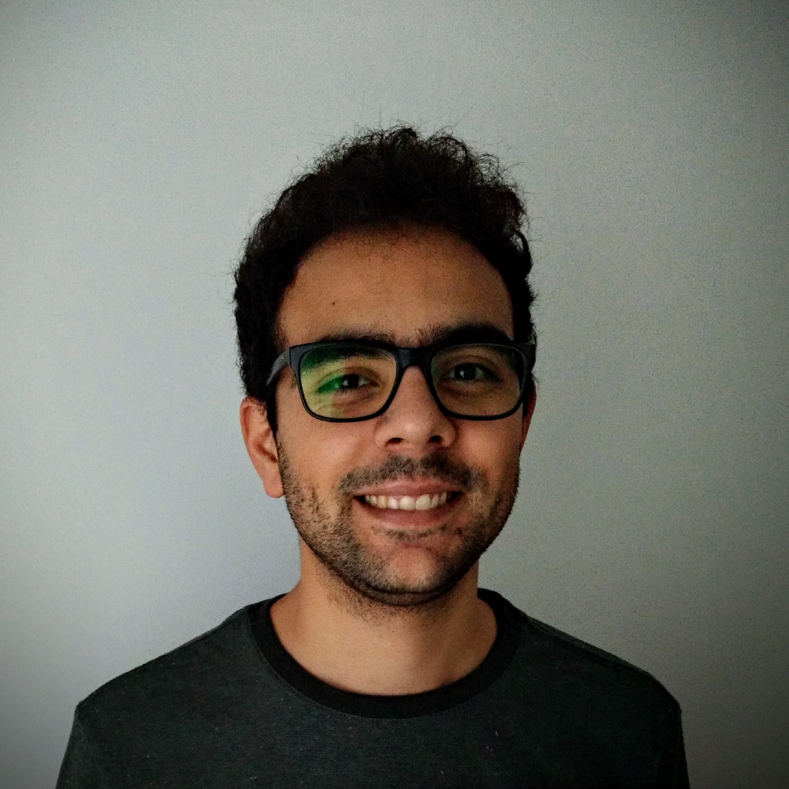

# Bruno Sánchez

I am an astronomer working at Duke University trying to understand our universe and its evolution through the discovery and characterization of astrophysical transient events.

My scientific contributions are mainly in the time domain astronomy field, and include image analysis and Machine Learning, as well as statistical studies with observational data from telescopes around the world.

## Research topics

My main interests include Cosmology, time-domain astronomy with transient events
and periodical variability, image analysis as well as applications of Machine
Learning to these topics.

Additionally I have worked with Gravitational Wave Astronomy, mostly related
with Electromagnetic Counterparts to Compact Binary Merger GW events.

I enjoy creating different data visualizations, and I have experience in Feature
Engineering for optimizing Machinge Learning model performance.

## Skills

* I have a PhD. in Astronomy and I am able to create and use mathematical and
physical models, to describe and explain data from diverse experiments.

* Additionally, I have skills in software developement using Python, R as well as
SQL and Fortran.

* I posses the know-how on scientific data-analysis pipeline design using Object Oriented Programming, Model-View-Controller patterns as well as diverse workflows for Extrac-Transform-Load processes.

* I am also able to optimize numeric calculus for a wide range of problems using a tool set involving many technologies, such as Hadoop, Dask, Tensorflow, Keras, etc.

* As an advocate of good practices of software developing I use Git version control techniques for
collaborating, and I am proficient in software testing as well, using techniques like unit-testing, continuous integration and property based testing.

### Publications

A full list of publications is available in [ADS](https://ui.adsabs.harvard.edu/public-libraries/NQfpQEIrQFGsSnBzZTI9yQ), [Google Scholar](https://scholar.google.com/citations?user=XrrlfKgAAAAJ&hl=en&gmla=AJsN-F6bMm7Zdnje_bv7m_eF6WL-ozOP82hAoH5bEMXflKwstKbzl0TeqVS4tH6KnoMeHxiBlOmcRMynSBSokzuNsGR2lOLuvdmEeMyqS0lmHikZSzHzr6Sg8THyAZPNXxuwLMjf00Wa), [ORCID](https://orcid.org/0000-0002-8687-0669) and [ResearchGate](https://www.researchgate.net/profile/Bruno-Sanchez-5).

